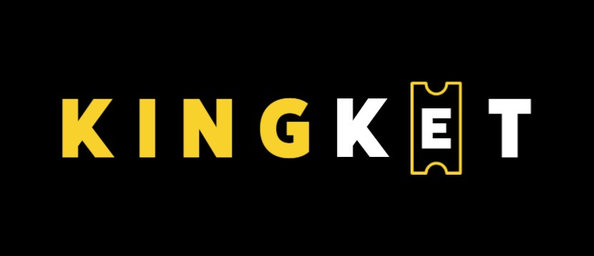

<h1 color=#F8D12F>KingKet</h1>

El proyecto KingKet esta orientado a la venta de tickets para diferentes rubros, iniciando en deporte con la idea de expandir hacia eventos musicales, teatro y otros eventos relacionados al arte y entretimiento.

La idea es optimizar la venta de tickets y garantizarle al usuario la mayor seguridad a la hora de efectuar la compra. Tambien como proyecto a futuro trabajar con los organizadores de eventos para que utilizen nuestra plataforma para promover todo tipo de eventos.
Es un proyecto orientado a todas las edades, para disfrutar en familia y amigos.

<h3 text-align=center>Descripcion de los integrantes del equipo.</h3>
<h4>Santos Gonzalez Palau</h4> 

26 anos, nacido en Argentina,; viviendo actualmente en Florida y estudiante de Ingenieria Ambiental. Amante del deporte y de los grandes     eventos.

<h4>Angel Angulo </h4>

 37 anos, nacido en Venezuela,; viviendo actualmente en Argentina. Trabajo para la empresa Johnson Controls. Fanatico del Futbol club Barcelona. 

<h4>Javier Zamorano</h4> 

34 anos, nacido y viviendo en Buenos Aires, Argentina,; Trabajo en desarrollo y producción en la industria del calzado. Me gustan las actividades al aire libre, deportes y Boca Juniors! 

<h3>Trello</h3>
<a href="https://trello.com/b/ZQu5T9mm/proyecto-integrador-e-commerce-kingtek">Acceso a tablero de tareas trello</a>

<h4>#Referentes del mercado</h4>

 <a href="https://www.eventbrite.com/">eventBrite</a>  El principal referente. Orientado a la musica y entretinimiento. Muy simple y accesible para cualquiera.

 <a href="https://ticketpass.org/"> Ticket pass</a>

 <a href="https://www.ticketmaster.com/ " >Ticket master</a> El preferido en cuanto a deporte. 

 <a href="https://www.ticketek.com.ar/"> ticket tek</a>   Referente local

 <a href="https://dice.fm/">Dicefm</a>  Gran referente de la venta de tickets para conciertos musicales.

